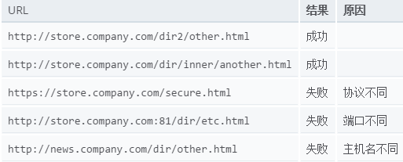

<h3>同源策略</h3>

javascript的同源策略限制了一个源(origin)中不允许加载来自其他源(origin)中的资源
如果两个页面拥有相同的协议（protocol），端口（如果指定），和主机，那么这两个页面就属于同一个源（origin）。

<h3>一、使用JSONP跨域</h3>
原理：采用script标签引入的js是不受同源策略的限制的
<pre>
  A页面(www.a.com)
    &lt;script&gt; 
        function JSONP_getUsers(users){  
            console.dir(users);  
        }  
    </script> 
  B页面(www.b.com)
      
</pre>

<h3>二、动态创建script标签</h3>
这种方法其实是JSONP跨域的简化版，JSONP只是在此基础上加入了回调函数。
<pre>
  www.b.com
    <?php>  
        echo 'var users=["paco","john","lili"]';//返回一个js变量users  
    ?>  
  www.a.com
  js.onload = js.onreadystatechange = function() {  
      if (!this.readyState || this.readyState === 'loaded' || this.readyState === 'complete') {  
          console.log(users);//此处取出其他域的数据  
          js.onload = js.onreadystatechange = null;  
      }  
  };  
</pre>
<h3>三、Access Control</h3>
<pre>
  例： a.com 对 b.com发起请求
  那么b.com的响应信息必须加入header("Access-Control-Allow-Origin: http://www.a.com");//表示允许a.com跨域请求本文件 
  
</pre>

<h3>四、window.name</h3>

<h3>五、服务器代理</h3>

<h3>六、document.domain签</h3>

<h3>七、使用HTML5的postMessage方法（两个iframe之间或者两个页面之间）</h3>
<pre>
A页面

  window.onload = function() {  
      var ifr = document.getElementById('ifr');  
      var targetOrigin = "http://www.b.com";  
      ifr.contentWindow.postMessage('hello world!', targetOrigin);  
  }; 
  
B页面
  var onmessage = function (event) {  
    var data = event.data;//消息  
    var origin = event.origin;//消息来源地址  
    var source = event.source;//源Window对象  
    if(origin=="http://www.a.com"){  
      console.log(data);//hello world!  
    }  
  };  
  if (typeof window.addEventListener != 'undefined') {  
    window.addEventListener('message', onmessage, false);  
  } else if (typeof window.attachEvent != 'undefined') {  
    //for ie  
    window.attachEvent('onmessage', onmessage);  
  }  
  
  
otherWindow.postMessage(message, targetOrigin);

otherWindow:   指目标窗口，也就是给哪个window发消息，是 window.frames 属性的成员或者由 window.open 方法创建的窗口
message:   是要发送的消息，类型为 String、Object (IE8、9 不支持)
targetOrigin:   是限定消息接收范围，不限制请使用 '*'
</pre>

<a href='http://blog.csdn.net/kongjiea/article/details/44201021'>参考</a>
