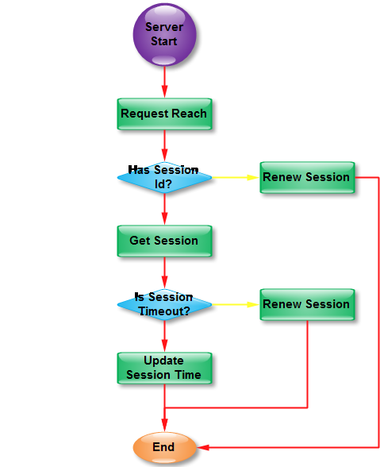

<a href="https://cnodejs.org/topic/4f16442ccae1f4aa27001059">服务器参考</a>

##session和cookie

0.cookie存储与客户端

1.当客户端发起访问并将cookie发送给服务器

2.服务器先根据cookie中的session_id查询sessionManager的_session属性中是否含有对应session_id的属性

3.若存在则将session中存储的用户信息拿出来并更新session过期时间

4.若不存在则创建session并存在sessionManager的_session属性中

<a href="http://www.jianshu.com/p/51d85be2e0e8">参考</a>
