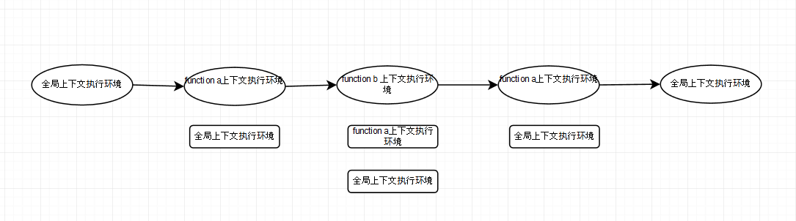

<h3>全局作用域</h3>

<pre>
    
    console.log(a);   //报错
    
    ====================================
    
    console.log(a);   //undefined
    var a;
    
    ====================================
    
    console.log(a);     等同于     var a;
                        ======》    console.log(a);     //undefined
    var a = 10                      a = 10;
    
    ====================================
    
    console.log(a);                       //function a(){}
    function a() {}
    
    ====================================
    
    console.log(a);                       //undefined
    var a = function () {}
    
    
    总结：
        js在内存中的执行顺序
        1.变量、函数表达式——变量声明，默认赋值为undefined；
        2.this——赋值；
        3.变量——赋值；
</pre>    

<h3>函数作用域</h3>

<pre>

    var a = 10;
    function b(){
        console.log(a);     //10
    }
    function c(x) {
        var a = 20;
        x();
        function display() {
            console.log(a);
        }
        display()   //20
    }
    c(b);           //10 20
    
    函数在定义的时候（不是调用的时候），就已经确定了函数体内部自由变量的作用域
    函数每被调用一次，都会产生一个新的执行上下文环境
    
    
<pre>

<h3>执行上下文栈</h3>

<pre>
    处于活动状态的执行上下文环境只有一个
    执行函数体语句之前，会创建一个新的执行上下文环境。
</pre>
<pre>
    var c = 10;                      //1.进入全局上下文环境
    var b;
    function a(x) {
        var d = 10;
        b()                     //3.进入function b上下文环境    
    }
    b = function () {
        
    }
    a(10);                        //2.进入function a上下文环境
    
    
    在执行代码之前，首先将创建全局上下文环境。
    
    c           undefined
    b           undefined
    a           function
    this        window
    
    然后是代码执行。代码执行到a()之前，上下文环境中的变量都在执行过程中被赋值。
    
    c           10
    b           function
    a           function
    this        window
    
    代码执行到a(),跳转到a函数内部，执行函数体语句之前，会创建一个新的执行上下文环境。
    
    d           undefined
    x           10
    arguments   [10]
    this        window
    
    ......
    
</pre>

